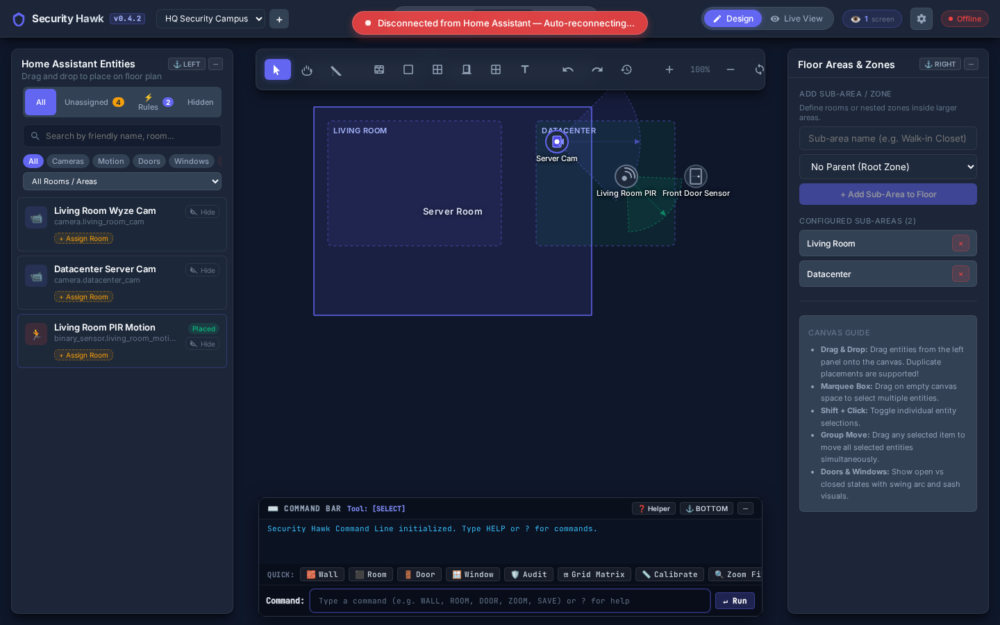
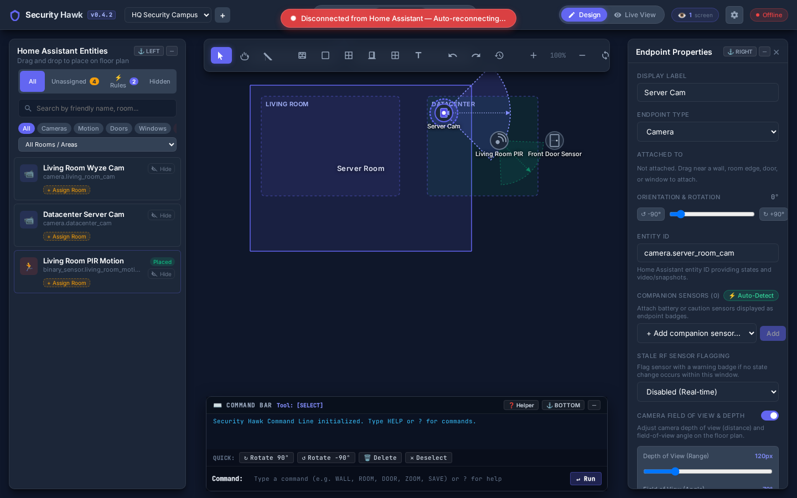
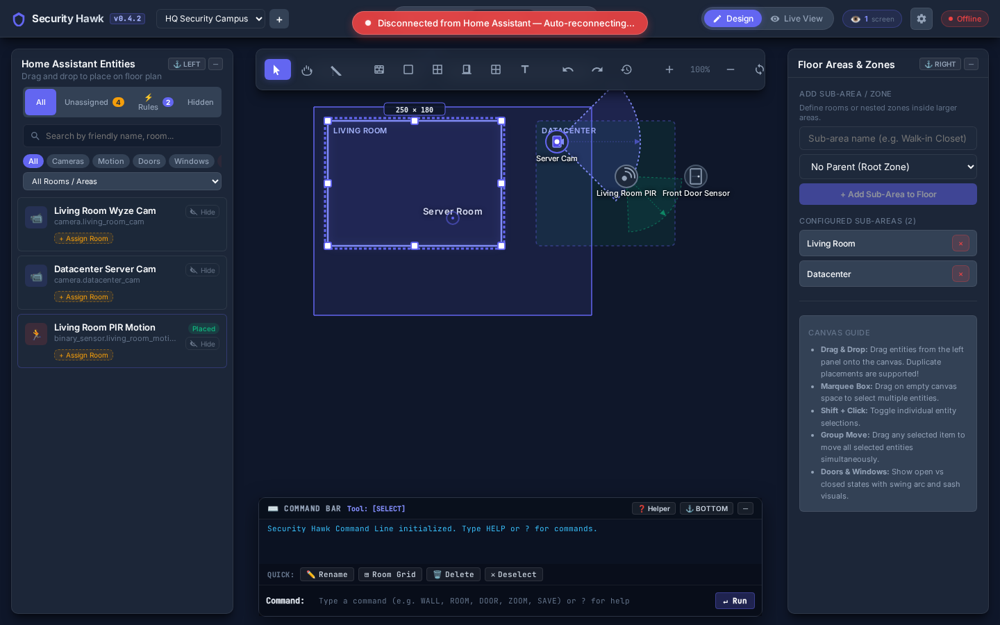
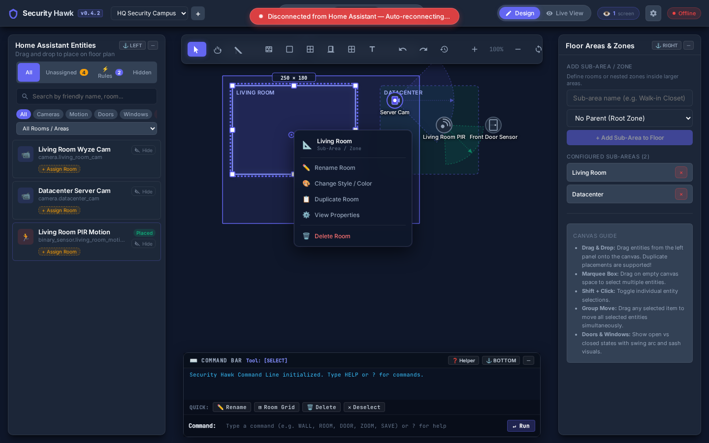
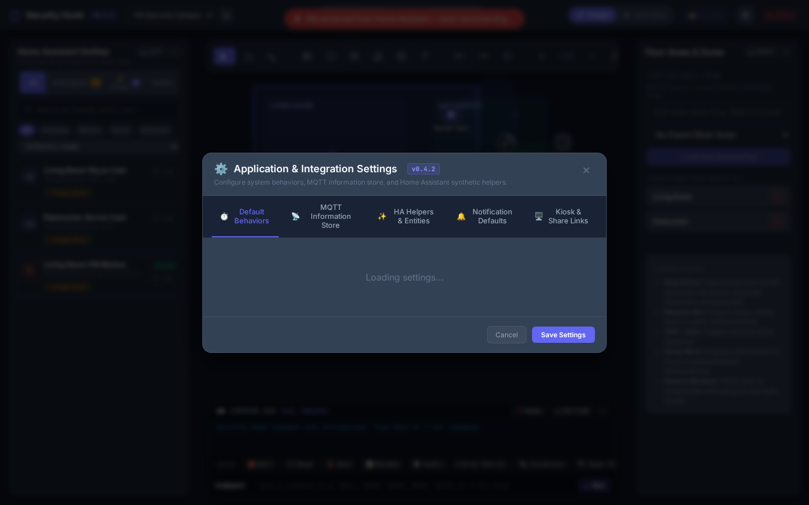
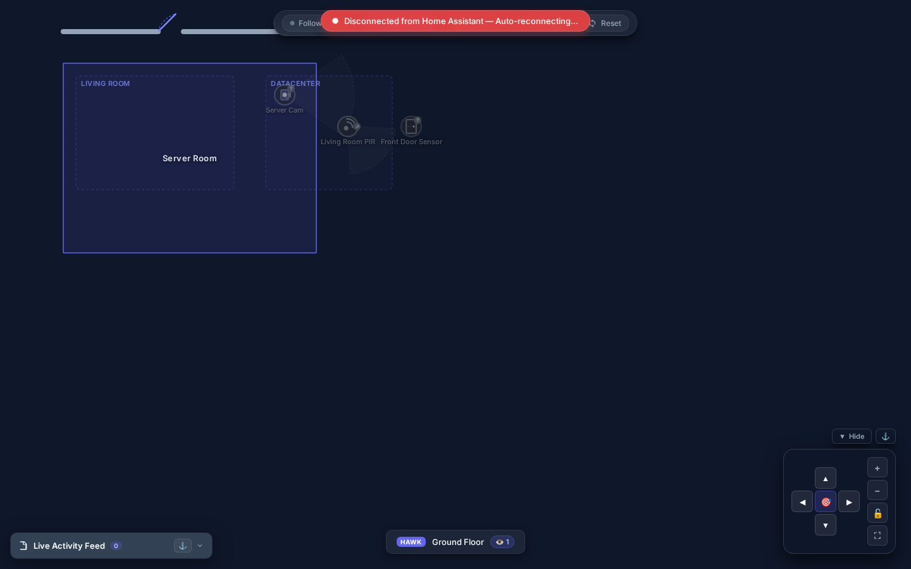

# Security Hawk: Visual Demonstration & Feature Walkthrough

This directory contains visual demonstrations, screenshots, and an operational guide for **Security Hawk**'s CAD floor plan editor, live security operations dashboard, and Home Assistant integration.

---

## 1. Design Canvas & Layout Overview

Security Hawk provides a dark-mode CAD workspace optimized for placing Home Assistant entities, drawing architectural walls, defining nested security zones, and configuring field-of-view visual cones.

### Key Interface Elements
- **Top Header**: Live application version tag (`v0.4.3`), building and floor plan selector, `Design` / `Live View` mode switcher, and viewport layout presets (`Mapping`, `CAD`, `Zen`).
- **Entity Picker (Left)**: Instant entity search, domain filtering (`Cameras`, `Motion`, `Doors`, `Windows`), unassigned tracking badge, and drag-and-drop placement.
- **Floor Areas & Properties (Right)**: Nest and organize architectural sub-areas, calibrate real-world scale (metres), and inspect selected entity attributes.
- **CAD Command Bar (Bottom)**: Keyboard-first terminal supporting 20+ CAD commands (`WALL`, `ROOM`, `DOOR`, `WINDOW`, `SELECT`, `PAN`, `ZOOM`, `SCALE`, `SAVE`, `UNDO`, `REDO`).

---

## 2. Sensor Placement & Field of View (FOV) Coverage

Security Hawk automatically renders directional Field of View (FOV) coverage cones and line-of-sight aiming vectors directly on the floor plan.

### FOV Cone Visuals
- **Cameras (Indigo Arc `#818cf8`)**: Displays wide-angle camera vision cones with directional arrows indicating exact aim. Adjust depth range (px/meters) and beam angle (70°–120°) in the Endpoint Properties panel.
- **Motion Sensors (Emerald Arc `#34d399`)**: Displays Passive Infrared (PIR) detection arcs to highlight room coverage and identify blind spots.
- **Companion Sensors**: Attach battery, temperature, or tamper sensors as contextual badges linked directly to primary endpoints.

---

## 3. Architectural Room Management & 8-Handle Resizing

Rooms, walls, and zones can be freely positioned, customized, and dynamically resized on the canvas.

### Room Editing Features
- **8-Handle Bounding Box**: Select any room to reveal white rectangular handles at `NW`, `N`, `NE`, `E`, `SE`, `S`, `SW`, and `W`.
- **Live Dimension Tooltip**: Displays instantaneous width and height measurements (e.g. `250 × 180`).
- **Draggable Outline**: Click and drag the dashed boundary line to move entire room polygons across the canvas without altering interior proportions.

---

## 4. Context Menus & Keyboard Ergonomics

Right-clicking elements on the canvas reveals contextual actions for quick operations.

### Context Actions & Shortcuts
- **Right-Click Context Menu**:
  - ✏️ **Rename Room / Endpoint**: Quick label editing.
  - 🎨 **Change Style / Color**: Cycle through room accent colors or custom fills.
  - 📋 **Duplicate Entity / Room**: Clone geometry or sensors instantly.
  - 🔄 **Rotate**: Quick 90° clockwise, counter-clockwise, or 180° inversion.
  - 🗑️ **Delete**: Remove elements from the floor plan.
- **Keyboard Shortcuts**:
  - <kbd>Delete</kbd> / <kbd>Backspace</kbd>: Immediately delete selected endpoints, rooms, or walls (with full undo support).
  - <kbd>Ctrl</kbd> + <kbd>Z</kbd> / <kbd>Ctrl</kbd> + <kbd>Y</kbd>: Undo and Redo operations.
  - <kbd>Esc</kbd>: Clear selections and close menus.
  - <kbd>Shift</kbd> + **Click**: Multi-select elements for synchronized movement.

---

## 5. Application Settings & Version Auditing

Access settings by clicking the gear icon (<kbd>⚙️</kbd>) in the header.

- **Version Tag**: Live application version tag matching GitHub and container releases.
- **Model Context Protocol (MCP)**: Configure AI agent integration levels (`read_only`, `design_only`, `rules_only`, `full_access`).
- **Ignored Entities**: Hide noisy entities from the entity picker.
- **Kiosk & TV Display**: Generate read-only wall tablet links with PIN authentication and quiet return timeouts.

---

## 6. Kiosk Mode & Unattended Wall Displays

Direct Kiosk mode loads a dedicated, full-screen **Live View** interface designed for wall tablets, smart TVs, and Google TV / Apple TV displays with zero editing controls or toolbars.

### Kiosk Features
- **Pure Live View**: Renders real-time sensor states, camera streams, and motion alerts with no toolbars, entity pickers, or CAD command prompts.
- **Minimal Status Pill**: Centered floating pill displaying building/floor title (`HAWK Ground Floor`) and active connected viewer count (`👁️ 1`).
- **Quiet Auto-Return**: Automatically reverts to the global overview after a configurable period of inactivity (default: 120s).
- **TV Remote Navigation**: D-pad navigation controls allowing TV remotes to jump between interactive sensors and view live camera feeds.
